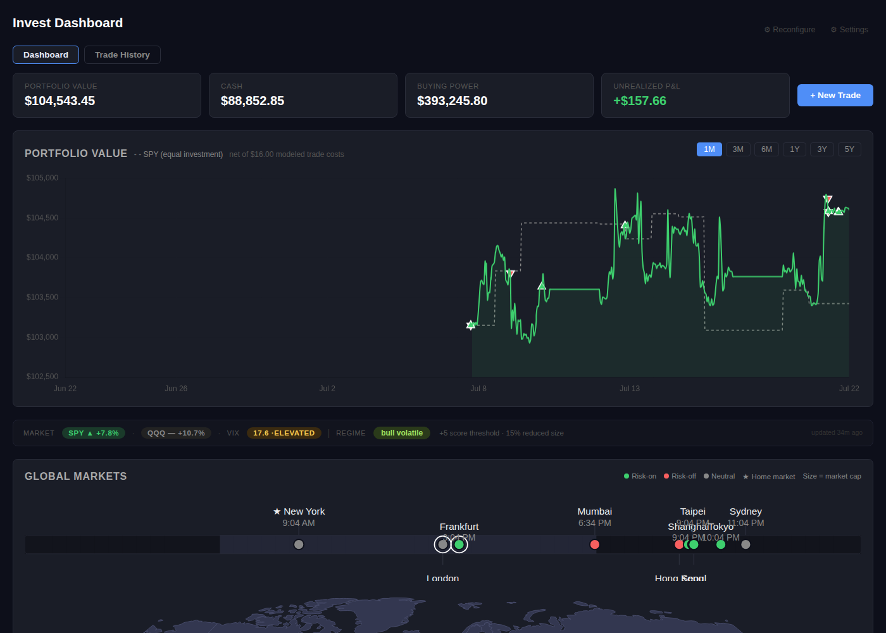
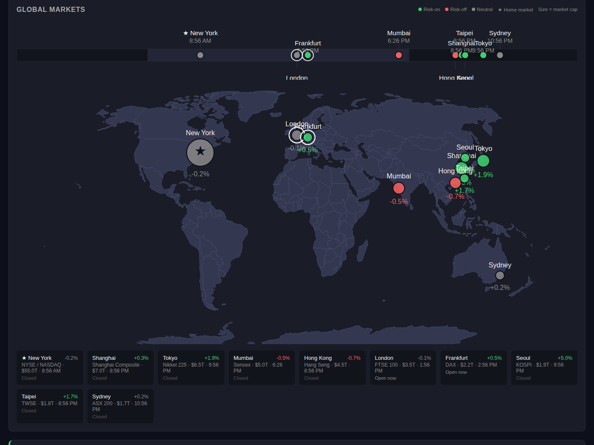
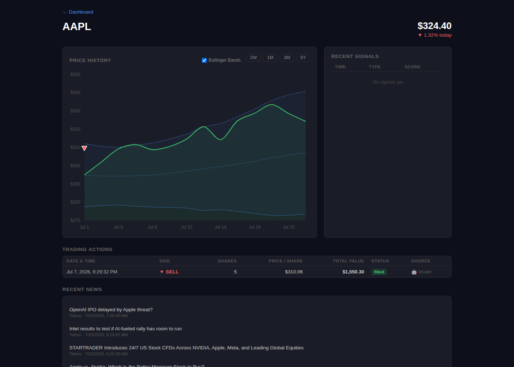
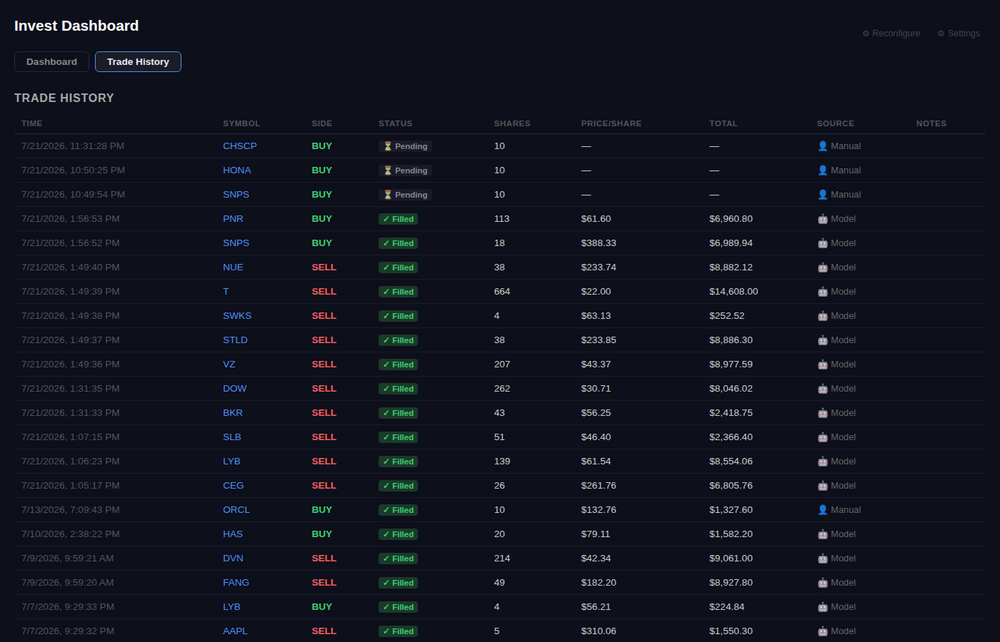

# homelab-trader

A self-hosted paper trading research platform: RSI + Bollinger Bands mean
reversion, gated by market regime (SPY/QQQ trend + VIX), with human
approval required before any order is placed. Runs against Alpaca's
paper trading API — no real money moves.



## How it works

- **`invest-ingest`** — background worker (hourly cycle). Pulls price
  history from Yahoo Finance, scores buy/sell signals (RSI + Bollinger
  Bands), gates them against the current market regime, sizes and
  creates trade proposals, checks stop-loss / thesis-complete / time-stop
  exits on open positions, scans the S&P 500 + core ETFs to promote/demote
  the watchlist, tracks overnight returns for a handful of leading
  international indices, and sends email/WhatsApp digests and alerts.
- **`invest-api`** — FastAPI service serving the dashboard and REST API.
  Trades only ever execute through here, and only for proposals a human
  has approved (or a manual trade placed directly).
- **PostgreSQL** — signals, proposals, trades, price history, universe
  scan results, and per-signal outcome tracking (forward 1d/5d/10d/20d
  returns, MAE/MFE) all live here. Schema is idempotent
  (`ingest/schema.sql`) and applied automatically on `invest-ingest`
  startup.

## More screenshots

**Global markets** — leading international indices as a world clock +
map, a rough "time machine" read on overnight risk sentiment before the
US market opens. Marker size is market cap, the ring shows which markets
are currently open. Purely informational for now — not wired into any
trading decision until it clears its own significance test.



**Symbol detail** — price history with a Bollinger Bands overlay (the
same `compute_bollinger()` the live scoring engine uses, not a
reimplementation), buy/sell trade markers, and recent signal history.



**Trade history** — kept on its own tab, separate from the at-a-glance
dashboard.



## Stack

Python (FastAPI + psycopg2), PostgreSQL, Docker Compose, Alpaca Paper
Trading API, Yahoo Finance, Finnhub (news, optional).

## Repo layout

```
api/
  main.py               FastAPI app: dashboard, REST API, trade execution
  templates/             Jinja2 dashboard UI (no frontend build step)
ingest/
  ingest.py              Main loop: prices, news, signals, digests, alerts
  signals.py              RSI/Bollinger scoring, position sizing, exit rules
  market_regime.py       SPY/QQQ/VIX regime detection -> score/alloc modifiers
  scanner.py              S&P 500 + ETF universe scan, watchlist promote/demote
  outcomes.py             Signal outcome backfill (forward returns, MAE/MFE)
  schema.sql              Idempotent DB schema, applied on startup
  research/backtests/    Offline validation scripts, run manually (not part
                           of the recurring loop) -- score calibration,
                           entry-rule significance testing, portfolio-level
                           Monte Carlo. Results persist to backtest_results.
docs/screenshots/        README images
docker-compose.yml
```

## Setup

1. Copy `.env.example` to `.env` and fill in credentials (Alpaca **paper**
   keys, a Postgres connection string, and an `INVEST_PASS` for dashboard
   basic auth — the API refuses to start without one).
2. `docker compose up -d --build`
3. Dashboard: `http://<host>:8100` (basic auth: `INVEST_USER` / `INVEST_PASS`)

Templates are baked into the `invest-api` image, so after editing anything
under `api/`, rebuild rather than just restarting:

```
docker compose build invest-api && docker compose up -d invest-api
```

## Key environment variables

| Variable | Required | Notes |
|---|---|---|
| `DATABASE_URL` | yes | Postgres connection string |
| `ALPACA_API_KEY` / `ALPACA_API_SECRET` | yes | **Paper** trading keys |
| `ALPACA_BASE_URL` | no | Defaults to `https://paper-api.alpaca.markets` |
| `INVEST_USER` / `INVEST_PASS` | `INVEST_PASS` required | Dashboard/API basic auth |
| `FINNHUB_API_KEY` | no | Enables news ingestion |
| `SMTP_USER` / `SMTP_PASS` / `DIGEST_TO` | no | Email digests (Gmail SMTP); can also be set via the Settings page at runtime |
| `ATQ_URL` | no | WhatsApp notification proxy, homelab-specific |
| `INGEST_INTERVAL` | no | Seconds between ingest cycles, default `3600` |
| `UNIVERSE_SCAN_INTERVAL` | no | Seconds between universe scans, default `14400` |

Notification/alert preferences (thresholds, digest times, toggles) are
configurable at runtime from the dashboard's Settings page and stored in
`app_settings`, not just env vars.

## Signal outcome tracking

Every scored buy/sell signal is recorded to `signal_outcomes` — whether it
became a proposal or was blocked (below threshold, duplicate, max
positions, sizing, no position held), plus its market/symbol regime and
price context. A background job backfills 1d/5d/10d/20d forward returns
and MAE/MFE from price history, and tracks approval outcome
(approved/rejected/ignored). This is the data the paper-trading validation
period is measuring against — see `GET /api/signal-outcomes`.

## Status

Currently in an extended paper-trading validation window. The strategy
(RSI + Bollinger mean reversion) is intentionally simple and unchanged;
active development is on measurement, risk controls, and calibration so
future strategy changes are driven by evidence rather than intuition.

## Disclaimer

Paper trading only. Not investment advice. No warranty; use at your own
risk if you adapt this for anything beyond a paper account.
