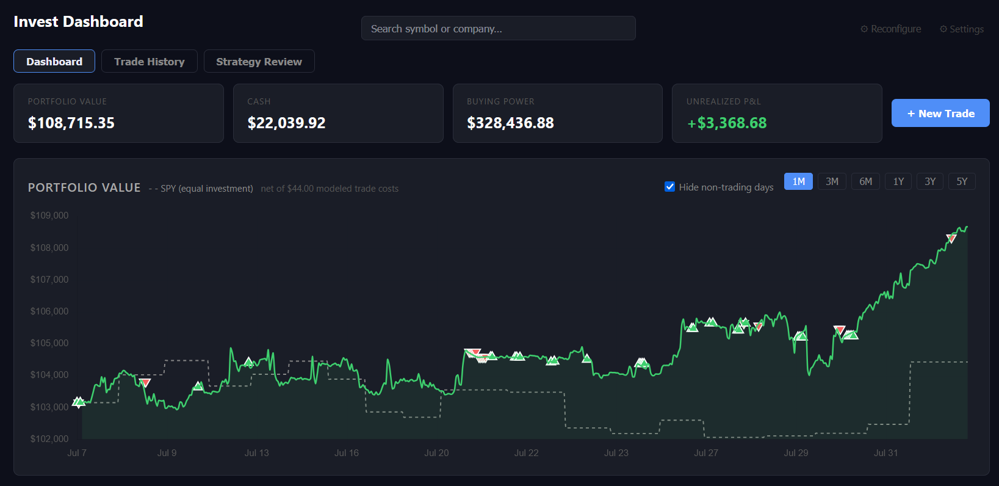
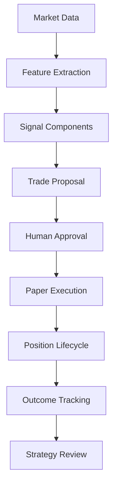
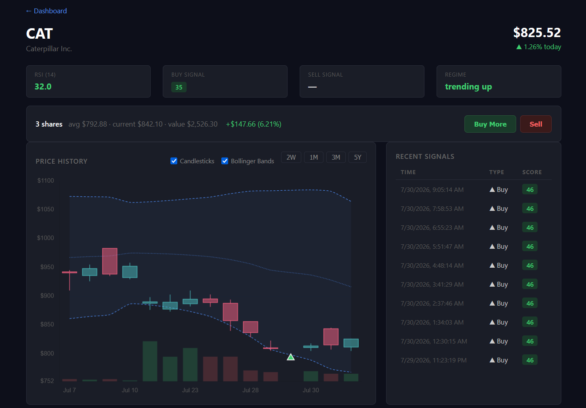
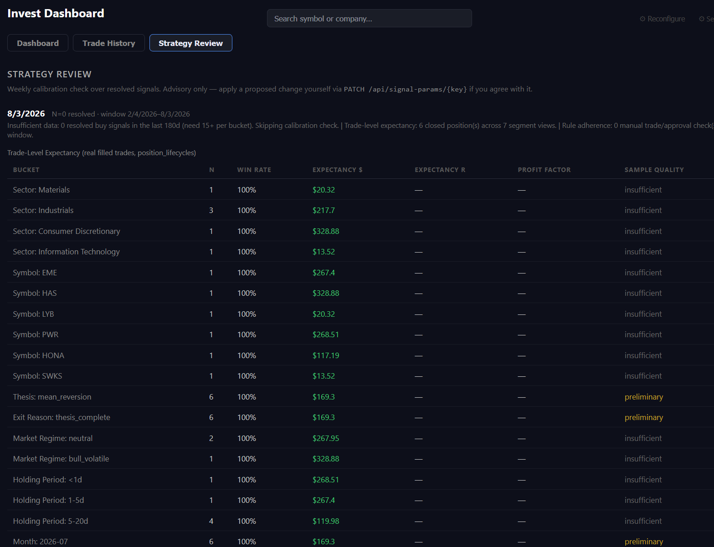
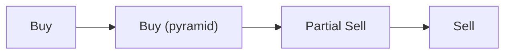
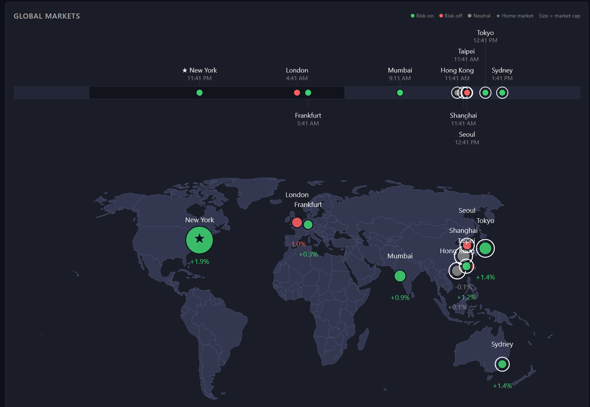
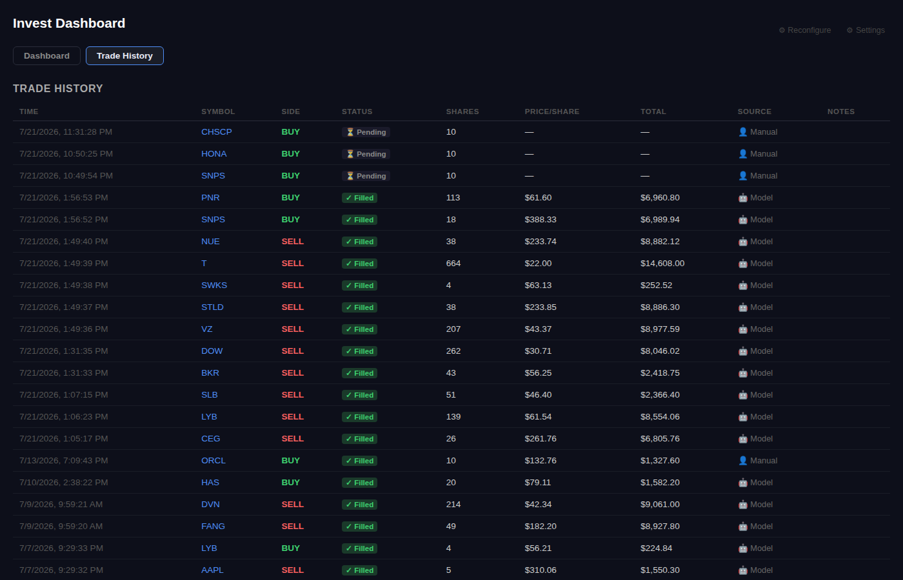

# homelab-trader

homelab-trader is a self-hosted quantitative trading research platform
focused on building evidence before capital. Rather than chasing ever
more complex strategies, it emphasizes measurement, reproducibility,
explainability, and disciplined experimentation. Every signal, proposal,
trade, and outcome is recorded so new ideas can be evaluated against
historical evidence before they ever influence real money. Runs against
Alpaca's **paper** trading API — no real money moves.

The strategy running today is RSI + Bollinger Bands mean reversion, gated
by market regime (SPY/QQQ trend + VIX). That's deliberately *not* the
point — it's the first experiment running inside a platform built to hold
any strategy to the same bar: propose, get approved, execute, measure the
outcome, review the evidence, repeat.

## Mission

**Live capital exists to maximize risk-adjusted returns, not to complete
experiments.** Once a thesis is trading real money, decisions about that
capital are made on its own merits — not to finish collecting a sample
size, prove a hypothesis right, or avoid admitting a thesis didn't pan
out. **Research hypotheses may continue in shadow after live capital
exits** — a thesis can keep generating signals/proposals/backtests against
paper or historical data indefinitely for its own sake, but that ongoing
research is never a reason to keep a live position open past what its own
risk/exit logic says.

**Whenever and wherever possible, provide information in the simplest
and plainest English possible.** Avoid technical jargon without
explanation. Provide tooltips, pop-ups, and guidance when technical
terminology is necessary. The person using this dashboard is not an
investment broker — a number or a status label is only useful if its
meaning is immediately clear without looking anything up.



The dashboard at a glance:
- **Current market regime** — bull/bear/neutral × VIX-bucket, gating how
  selective and how large new positions are allowed to be.
- **Open positions and proposals** — what's held, what's pending a human
  decision.
- **Portfolio performance** — value over time against SPY, with real
  buy/sell markers.

## The research pipeline

Every trade this platform ever places goes through the same seven stages
— no exceptions, no shortcuts for a strategy that "seems obviously right."


```mermaid
flowchart TD
    A[Market Data] --> B[Feature Extraction]
    B --> C[Signal Components]
    C --> D[Trade Proposal]
    D --> E[Human Approval]
    E --> F[Paper Execution]
    F --> G[Position Lifecycle]
    G --> H[Outcome Tracking]
    H --> I[Strategy Review]
```

Nothing skips the human-approval step. Nothing skips outcome tracking.
The strategy itself is just one replaceable stage in the middle of this —
everything around it exists to keep it honest.

## Symbol detail



Candlesticks, Bollinger Bands, volume, buy/sell trade markers, and recent
signal history — all computed with the *exact same functions* the live
scoring engine uses (`compute_bollinger()`, not a reimplementation for
display purposes). What you see here is what the engine saw.

## Strategy Review



This is probably the least "trading bot" part of the repo, and the most
important. Once a week, the platform looks at its own trade history and
asks two separate questions:

1. **Is the underlying signal actually predictive?** — calibration checks
   against every generated signal, whether it ever became a trade or not.
2. **Are the real trades actually profitable, risk-adjusted?** — win rate,
   profit factor, dollar expectancy, and R-multiple expectancy (with its
   own sample-size denominator, since a near-empty sample never gets
   silently averaged into a real-looking number), segmented by thesis,
   exit reason, market regime, sector, holding period, and calendar month.

A third check runs alongside those two: **rule-adherence tracking** — did
a manual trade or a delayed proposal approval quietly skip one of the risk
gates (circuit breaker, position sizing, sector cap, cooldown, earnings
blackout) the automated pipeline always enforces? Bypassing a rule isn't
blocked, but it's never silent either.

Every sample-size-limited result is labeled `insufficient` /
`preliminary` / `established` rather than presented with false
confidence — a strategy doesn't get to claim an edge on five trades.

## Position lifecycle


```mermaid
flowchart LR
    B1[Buy] --> B2["Buy (pyramid)"] --> P[Partial Sell] --> S[Sell]
```

Positions are matched true FIFO — each entry lot keeps its own price and
stop until consumed oldest-first by a sell, not blended into a running
average. Every closed lifecycle records:

- **Realized R** — net P&L normalized against the position's *initial*
  risk, never renegotiated as it's added to.
- **MAE / MFE** — pathwise, against a time-varying weighted cost basis,
  not just entry-to-exit.
- **Holding period**, planned vs. actual risk, and data-quality flags
  (e.g. a partial fill split across concurrent lots).

Historical trades placed before this existed simply have no R-multiple
data — that's permanent and correct, not a gap to backfill.

## Global markets



Nine leading international indices as a world clock + map — a rough
"time machine" read on overnight risk sentiment before the US market
opens, sized by market cap, with a ring showing which markets are
currently open. Purely informational for now: it doesn't touch any
trading decision until it clears its own significance test, same
discipline as every other signal here.

Trade history — the full append-only ledger, grouped by symbol with
realized win/loss badges — lives on its own tab, separate from the
at-a-glance dashboard.



## Design principles

- **Paper trading first.** No live capital until a strategy has actually
  earned it.
- **Every signal is measured.** Whether it became a trade or was blocked,
  it's recorded and its forward outcome is tracked.
- **Human approval before execution.** The automated pipeline proposes;
  it never executes on its own.
- **Strategies compete on evidence, not intuition.** Win rate alone is a
  trap — a bucket can win often on small moves and lose rarely on big
  ones and still be the worse one to hold.
- **New data sources are introduced only after demonstrating incremental
  value.** A capability spike before a collector, every time.
- **No AI magic boxes.** Every score, gate, and rejection reason is a
  plain rule you can read, not a black-box inference.

## Current status

```
✓ Paper trading (Alpaca paper API)
✓ Human-approval workflow for every trade
✓ Position lifecycle analysis (true FIFO, R-multiples, pathwise MAE/MFE)
✓ Expectancy reporting ($ and R, sample-quality tiered)
✓ Rule-adherence tracking (manual-trade / delayed-approval bypass detection)
✓ Signal outcome database (forward 1d/5d/10d/20d returns, MAE/MFE)

In progress
• Market-regime history + regime-similarity backtesting
• Pluggable strategy architecture ("strategy shapes," not just tuning knobs)

Evaluated, deferred
• Options / earnings-volatility scanner — real capability spike run
  against live market-data entitlements; deferred on cost, not merit
  (see docs/adr/0001-opra-economic-constraint.md)

Future
• Additional data sources (macro, insider filings, global news) — only
  after each clears its own capability spike
• Live capital deployment — only after extended validation
```

## How it works

- **`invest-ingest`** — background worker (hourly cycle). Pulls price
  history from Yahoo Finance, scores buy/sell signals (RSI + Bollinger
  Bands), gates them against the current market regime, sizes and
  creates trade proposals, checks stop-loss / thesis-complete / time-stop
  exits on open positions, scans the S&P 500 + core ETFs to promote/demote
  the watchlist, tracks overnight returns for a handful of leading
  international indices, and sends email/WhatsApp digests and alerts.
- **`invest-api`** — FastAPI service serving the dashboard and REST API.
  Trades only ever execute through here, and only for proposals a human
  has approved (or a manual trade placed directly).
- **PostgreSQL** — signals, proposals, trades, position lifecycles, price
  history, universe scan results, and per-signal outcome tracking all
  live here. Schema is idempotent (`ingest/schema.sql`) and applied
  automatically on `invest-ingest` startup.

## Stack

Python (FastAPI + psycopg2), PostgreSQL, Docker Compose, Alpaca Paper
Trading API, Yahoo Finance, Finnhub (news, optional).

## Repo layout

```
api/
  main.py               FastAPI app: dashboard, REST API, trade execution
  templates/             Jinja2 dashboard UI (no frontend build step)
ingest/
  ingest.py              Main loop: prices, news, signals, digests, alerts
  signals.py              RSI/Bollinger scoring, position sizing, exit rules
  market_regime.py       SPY/QQQ/VIX regime detection -> score/alloc modifiers
  scanner.py              S&P 500 + ETF universe scan, watchlist promote/demote
  outcomes.py             Signal outcome backfill (forward returns, MAE/MFE)
  build_position_lifecycles.py  True-FIFO lifecycle/R-multiple builder
  postmortem.py           Weekly calibration + expectancy + rule-adherence review
  schema.sql              Idempotent DB schema, applied on startup
  research/backtests/    Offline validation scripts, run manually (not part
                           of the recurring loop) -- score calibration,
                           entry-rule significance testing, portfolio-level
                           Monte Carlo. Results persist to backtest_results.
shared/
  expectancy.py           Win rate, profit factor, $ and R expectancy
  rule_adherence.py        Re-checks automated risk gates for manual trades
  position_lifecycles.py   True FIFO lot matching, R-multiples, pathwise MAE/MFE
docs/
  adr/                    Architecture decision records
  screenshots/            README images
docker-compose.yml
```

## Setup

1. Copy `.env.example` to `.env` and fill in credentials (Alpaca **paper**
   keys, a Postgres connection string, and an `INVEST_PASS` for dashboard
   basic auth — the API refuses to start without one).
2. `docker compose up -d --build`
3. Dashboard: `http://<host>:8100` (basic auth: `INVEST_USER` / `INVEST_PASS`)

Templates are baked into the `invest-api` image, so after editing anything
under `api/`, rebuild rather than just restarting:

```
docker compose build invest-api && docker compose up -d invest-api
```

## Key environment variables

| Variable | Required | Notes |
|---|---|---|
| `DATABASE_URL` | yes | Postgres connection string |
| `ALPACA_API_KEY` / `ALPACA_API_SECRET` | yes | **Paper** trading keys |
| `ALPACA_BASE_URL` | no | Defaults to `https://paper-api.alpaca.markets` |
| `INVEST_USER` / `INVEST_PASS` | `INVEST_PASS` required | Dashboard/API basic auth |
| `FINNHUB_API_KEY` | no | Enables news ingestion |
| `SMTP_USER` / `SMTP_PASS` / `DIGEST_TO` | no | Email digests (Gmail SMTP); can also be set via the Settings page at runtime |
| `ATQ_URL` | no | WhatsApp notification proxy, homelab-specific |
| `INGEST_INTERVAL` | no | Seconds between ingest cycles, default `3600` |
| `UNIVERSE_SCAN_INTERVAL` | no | Seconds between universe scans, default `14400` |

Notification/alert preferences (thresholds, digest times, toggles) are
configurable at runtime from the dashboard's Settings page and stored in
`app_settings`, not just env vars.

## Signal outcome tracking

Every scored buy/sell signal is recorded to `signal_outcomes` — whether it
became a proposal or was blocked (below threshold, duplicate, max
positions, sizing, no position held), plus its market/symbol regime and
price context. A background job backfills 1d/5d/10d/20d forward returns
and MAE/MFE from price history, and tracks approval outcome
(approved/rejected/ignored). This is the data the weekly Strategy Review
measures against — see `GET /api/signal-outcomes`.

## Disclaimer

Paper trading only. Not investment advice. No warranty; use at your own
risk if you adapt this for anything beyond a paper account.
